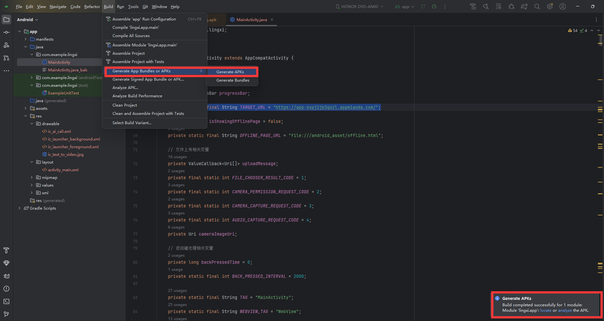
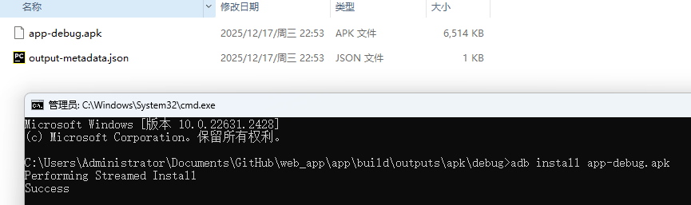
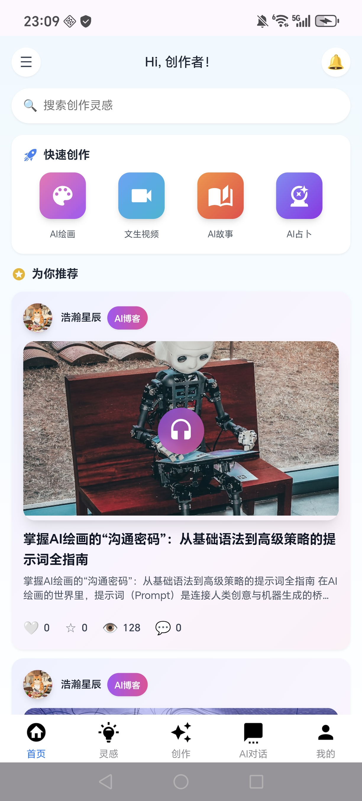

### 项目是基于秒哒小程序搭建apk，只需要将秒哒的URL替换到MainActivity.java的TARGET_URL就可以，操作流程如下：
### 1.下载代码，安装Android Studio程序
### 2.在MainActivity.java中将TARGET_URL改成自己的
private static final String TARGET_URL = "https://app-6xpj2jb3qozl.appmiaoda.com/";
### 3.生成apk

### 4.安装apk

### 5.手机上运行apk，可以安装我的apk进行体验
[e99a7a53343af2af53f7c7f65df3a931.mp4](e99a7a53343af2af53f7c7f65df3a931.mp4)

